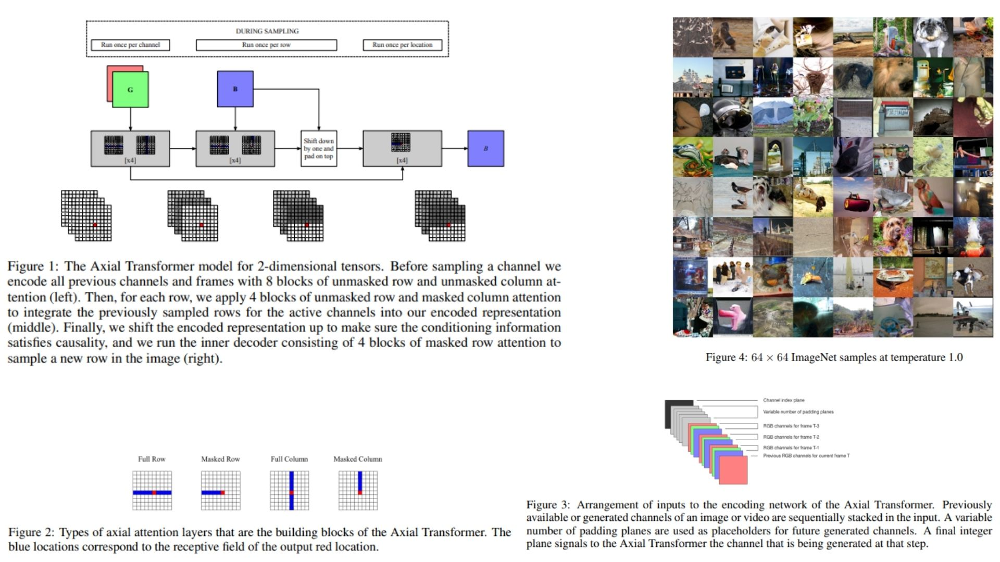

# 🌌 AxialTransformer-Compact — Autoregressive 2D Image Modeling

This repository provides a **PyTorch implementation** of the **Axial-Transformer**  
for **autoregressive image modeling**, faithfully replicating the paper’s  
architecture, mathematics, and block structure 🪐.

The focus is **on code clarity and reproducibility**, not on training or benchmarks.  
The model implements:
- Factorized **axial attention** (row + column) 🧬
- **Masked causal attention** for autoregressive sampling 🔒
- Integration of **positional embeddings** with horizontal and vertical contexts 🧩

**Paper reference:**  
[Axial-Deep Learning for Autoregressive Image Modeling](https://arxiv.org/abs/1912.12180) 🌠

---

## 🔭 Overview — Long-Range Spatial Dependency



> Convolutional networks struggle with **global dependencies** in 2D images.  
> Axial-Transformer addresses this by **factorizing attention** along rows and columns,  
> allowing each pixel to attend efficiently to all previous pixels while preserving **causality**.

Highlights:

- **Convolutions** capture local structure
- **Axial attention** models global, long-range interactions
- **Masked attention** ensures $$p(x) = \prod_i p(x_i | x_{<i})$$ causality
- **Positional embeddings** provide spatial context along both axes

---

## 🧮 Attention Formulation

For an input tensor  

$$
x \in \mathbb{R}^{H \times W \times D}
$$

the **row** and **column** attention computations produce contexts:

$$
u = \text{AxialAttention}_{\text{row+col}}(x_{\text{above}})
$$

$$
h = \text{MaskedRowAttention}(x_{\text{current row, left}})
$$

These are combined with positional embeddings:

$$
h_i = h_i + u_i + \text{pos}_i
$$

Finally, the logits over pixel values are produced via a linear layer:

$$
\text{logits}_i = W_o h_i
$$

This **factorized approach** allows the model to scale to high-resolution images efficiently.

---

## ⚙ Architectural Principle

- **Pixel embeddings** map discrete pixel values into $$D$$-dimensional vectors
- **Axial blocks** alternate row and column attention with feedforward layers
- **Upper-context computation** handles information from previous rows
- **Decoder stack** combines masked row attention with upper-context to enforce causality
- The model can compute **exact log-likelihoods** autoregressively

---

## 🧩 Repository Structure

```bash
AxialTransformer-Replication/
├── src/
│   ├── config.py
│   │
│   ├── utils/
│   │   ├── masks.py             # row / column causal masks
│   │   └── visualization.py     # attention & receptive field görselleri
│   │
│   ├── attention/
│   │   └── attention.py         # AxialAttention_k + MaskedAttention_k
│   │
│   ├── layers/
│   │   └── layers.py            # shift_right, shift_down, embeddings, FFN
│   │
│   ├── blocks/
│   │   └── blocks.py            # AttentionBlock + TransformerBlock
│   │
│   ├── decoder/
│   │   └── decoder.py           # u compute + h compute + h = h+u+pos
│   │
│   │
│   └── models/
│       └── model.py            
│
├── images/
│   └── figmix.jpg
│
├── requirements.txt
└── README.md
```
---


## 🔗 Feedback

For questions or feedback, contact: [barkin.adiguzel@gmail.com](mailto:barkin.adiguzel@gmail.com)
